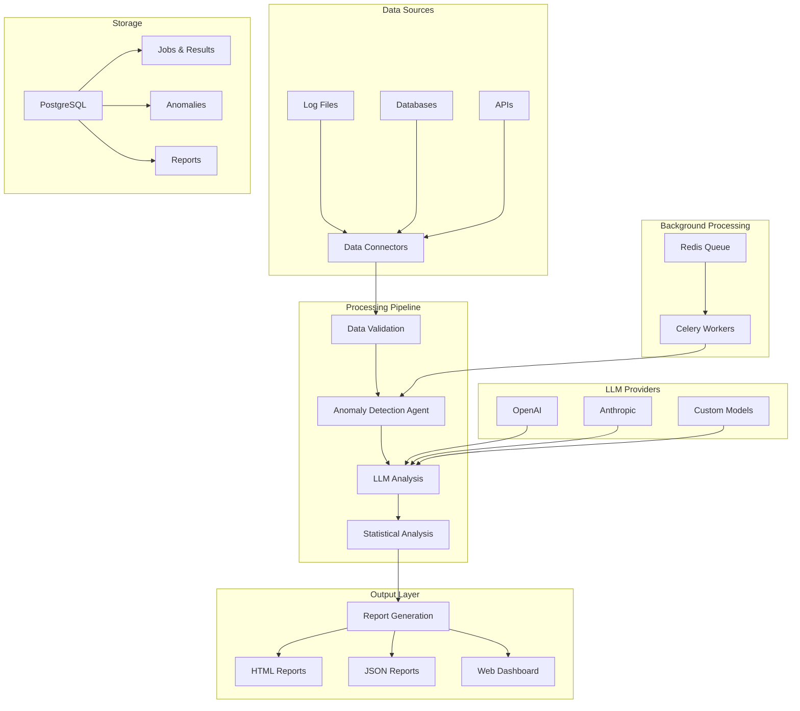

# 🏗️ Architecture Overview

## System Architecture

## Component Details

### Data Connectors
- **Log Connector**: Parses various log formats (JSON, Apache, Nginx, Custom)
- **Database Connector**: Executes SQL queries with time filtering
- **API Connector**: Fetches data from REST APIs with pagination support

### LLM Integration
- **OpenAI Provider**: GPT models for analysis and embeddings
- **Anthropic Provider**: Claude models for advanced reasoning
- **Extensible Architecture**: Easy to add new providers

### Anomaly Detection
- **Statistical Analysis**: Isolation Forest, frequency analysis
- **Pattern Recognition**: Error pattern detection
- **Semantic Analysis**: LLM-powered content analysis
- **Multi-level Severity**: Critical, High, Medium, Low

### Report Generation
- **HTML Reports**: Beautiful, responsive reports with modern styling
- **JSON Reports**: Machine-readable format for integration
- **Extensible**: Easy to add new formats (PDF, CSV, etc.)

## Data Flow

1. **Data Ingestion**: Connectors fetch data from various sources
2. **Preprocessing**: Data validation and cleaning
3. **Analysis**: Multi-layered anomaly detection
4. **LLM Enhancement**: AI-powered insights and recommendations
5. **Report Generation**: Automated report creation
6. **Dashboard Display**: Real-time monitoring and management

## Scalability Features

- **Background Processing**: Celery workers for scalable processing
- **Queue Management**: Redis for task distribution
- **Database Optimization**: Efficient queries and indexing
- **Caching**: Redis caching for improved performance
- **Docker Support**: Easy deployment and scaling

## Security Features

- **API Key Management**: Secure storage of LLM API keys
- **Input Validation**: Comprehensive data validation
- **SQL Injection Protection**: Parameterized queries
- **Rate Limiting**: Protection against abuse
- **CORS Configuration**: Secure cross-origin requests
